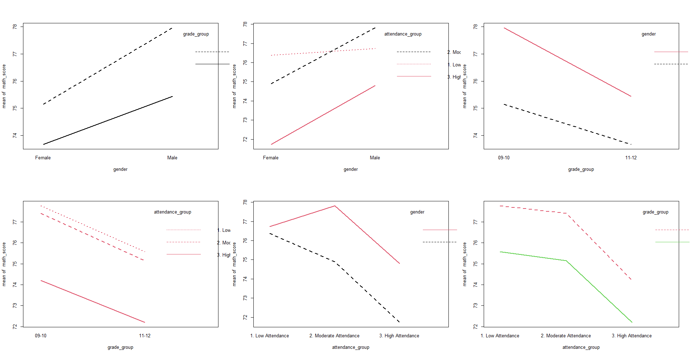
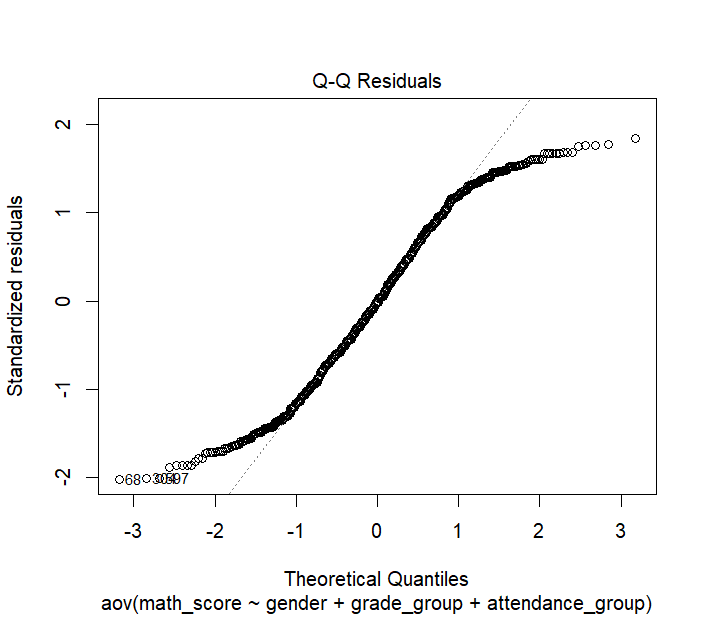
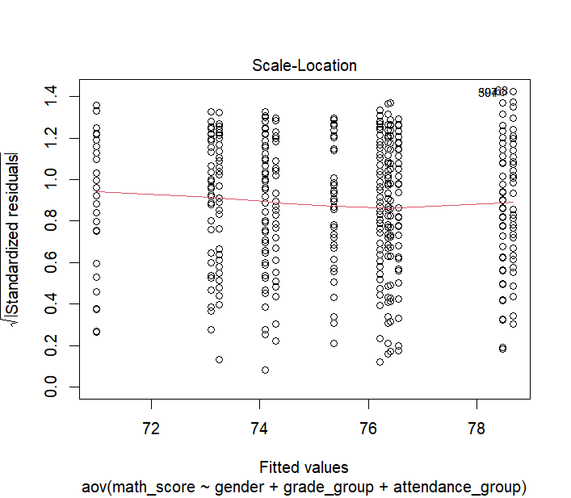

# Three-Way ANOVA on Student Performance
This project investigates the influence of gender, grade level, and attendance rate on students’ mathematics performance using a three-way ANOVA approach. The analysis is based on a dataset of 681 high school students and focuses on identifying both main effects and interaction effects among the three factors.

Key steps include:

- Data cleaning and transformation (grouping grades, categorizing attendance, filtering gender)

- Descriptive statistics and visualization of variable interactions

- Fitting both additive and interaction ANOVA models

- Validating model assumptions (normality, independence, homogeneity of variance)

- Performing post hoc Tukey tests to explore pairwise differences

The results highlight the importance of gender and attendance in predicting academic outcomes, with interaction effects suggesting deeper contextual dynamics. Despite minor deviations from normality, the ANOVA model remains robust and provides valuable insights into how demographic and behavioral factors jointly shape student performance.

## 1. Loading and Processing Data

### 1.1. Loading the Data and Selecting Variables of Interest

```r
data <- read.csv('student_info.csv')
```

|student_id |name       |gender | age| grade_level| math_score| reading_score| writing_score| attendance_rate|parent_education | study_hours|internet_access |lunch_type      |extra_activities |final_result |
|:----------|:----------|:------|---:|-----------:|----------:|-------------:|-------------:|---------------:|:----------------|-----------:|:---------------|:---------------|:----------------|:------------|
|S1         |Student_1  |Other  |  17|          10|         74|            61|            90|        94.66000|Master's         |    4.120192|Yes             |Free or reduced |Yes              |Fail         |
|S2         |Student_2  |Male   |  17|          12|         99|            70|            91|        93.17323|Bachelor's       |    2.886506|No              |Free or reduced |No               |Pass         |
|S3         |Student_3  |Other  |  17|           9|         59|            60|            99|        98.63110|PhD              |    1.909926|No              |Free or reduced |No               |Fail         |
|S4         |Student_4  |Other  |  17|          12|         70|            88|            69|        96.41962|PhD              |    1.664740|No              |Standard        |No               |Pass         |
|S5         |Student_5  |Male   |  15|           9|         85|            77|            94|        91.33211|PhD              |    2.330918|Yes             |Free or reduced |No               |Pass         |
|S6         |Student_6  |Male   |  17|          11|         61|            54|            89|        93.14061|Master's         |    4.759697|No              |Free or reduced |Yes              |Fail         |
|S7         |Student_7  |Other  |  16|           9|         76|            66|            88|        97.96773|Bachelor's       |    2.372107|Yes             |Free or reduced |No               |Pass         |
|S8         |Student_8  |Female |  16|          11|         89|            69|            98|        87.99038|PhD              |    4.952496|No              |Standard        |Yes              |Pass         |
|S9         |Student_9  |Other  |  17|          12|         51|            90|            72|        86.53589|High School      |    2.940922|No              |Standard        |No               |Pass         |
|S10        |Student_10 |Other  |  17|          11|         62|            95|            96|        80.21622|Bachelor's       |    1.716656|Yes             |Standard        |Yes              |Fail         |

In this study, I selected three independent variables: `gender`, `grade_level`, and `attendance_rate`, to analyze their effects on the dependent variable `math_score` using **ANOVA**. These variables were chosen due to their potential influence on academic performance and their practical relevance in an educational context.

```r
# Select variables relevant for analysis
data <- data %>%
  select(gender, grade_level, attendance_rate, math_score)
```
|gender | grade_level| attendance_rate| math_score|
|:------|-----------:|---------------:|----------:|
|Other  |          10|        94.66000|         74|
|Male   |          12|        93.17323|         99|
|Other  |           9|        98.63110|         59|
|Other  |          12|        96.41962|         70|
|Male   |           9|        91.33211|         85|
|Male   |          11|        93.14061|         61|
|Other  |           9|        97.96773|         76|
|Female |          11|        87.99038|         89|
|Other  |          12|        86.53589|         51|
|Other  |          11|        80.21622|         62|


### 1.2. Examine descriptive statistics and data types

```r
# Initial data inspection
summary(data)
glimpse(data)
```

**Summary**

|   gender        | grade_level  |attendance_rate |  math_score  |
|:----------------|:-------------|:---------------|:-------------|
|Length:681       |Min.   : 9.00 |Min.   :80.00   |Min.   :50.00 |
|Class :character |1st Qu.: 9.00 |1st Qu.:85.02   |1st Qu.:64.00 |
|Mode  :character |Median :10.00 |Median :89.68   |Median :76.00 |
|NA               |Mean   :10.47 |Mean   :89.87   |Mean   :75.65 |
|NA               |3rd Qu.:12.00 |3rd Qu.:94.62   |3rd Qu.:88.00 |
|NA               |Max.   :12.00 |Max.   :99.95   |Max.   :99.00 |

**Data Structure**  
Rows: 681  
Columns: 4  
$ gender          <chr> "Male", "Male", "Male", "Female", "Male", "Female", "Male", "Female", "Female", "Fem…  
$ grade_level     <int> 12, 9, 11, 11, 10, 11, 10, 9, 12, 12, 9, 11, 11, 12, 10, 11, 11, 9, 11, 11, 12, 10, …  
$ attendance_rate <dbl> 93.17323, 91.33211, 93.14061, 87.99038, 82.08909, 89.27963, 82.37418, 99.61136, 84.2…  
$ math_score      <int> 99, 85, 61, 89, 65, 81, 83, 60, 59, 64, 66, 89, 67, 58, 74, 89, 63, 74, 69, 93, 81, …  

To prepare the data for analysis, the following transformations were applied:

- Gender: Only records with valid values of "Male" or "Female" are retained, with any ambiguous or missing entries removed.

- Grade Level: The original grade levels are grouped into two broader academic categories to simplify analysis:

  - Grades 9 and 10 are combined into "Grade 9–10"    

  - Grades 11 and 12 are combined into "Grade 11–12"

- Attendance Rate: The continuous attendance_rate variable is categorized into three ordinal levels based on quartile thresholds:

  - "Low Attendance": ≤ 1st quartile (≤ 84.96)

  - "Moderate Attendance": between 1st and 3rd quartile (84.97 – 94.63)

  - "High Attendance": > 3rd quartile (> 94.63)

### 1.3. Missing Data Check

```r
# Check for missing values in each column
colSums(is.na(data))
```

|                |  x|
|:---------------|--:|
|gender          |  0|
|grade_level     |  0|
|attendance_rate |  0|
|math_score      |  0|

The dataset contains no missing or null values.

### 1.4. Data Preprocessing

**Gender**
```r
# Keep only Male and Female students for consistent gender analysis
data <- data %>%
  filter(gender %in% c("Male", "Female"))
```

**Grade Group**
```r
# Group grade levels into lower (09–10) and upper (11–12) high school
data <- data %>%
  mutate(grade_group = case_when(
    grade_level <= 10 ~ "09-10",
    grade_level >= 11 ~ "11-12"
  ))
```

**Attendace Group**

```r
qs <- quantile(data$attendance_rate, probs = c(0.25, 0.75), na.rm = TRUE)

data <- data %>%
  mutate(attendance_group = case_when(
    attendance_rate <= qs[1] ~ "1. Low Attendance",
    attendance_rate <= qs[2] ~ "2. Moderate Attendance",
    attendance_rate >  qs[2] ~ "3. High Attendance"
  ))
```

## 2. Three-Way ANOVA Model

### 2.1. Visualizing the Interaction Between Three Factors Using Plots

```r
par(mfrow = c(2, 3))

# Examines whether the effect of grade level on math scores differs between male and female students
with(data, interaction.plot(gender, grade_group, math_score, lwd = 2, col = 1:1))

# Assesses whether attendance levels influence math scores differently by gender
with(data, interaction.plot(gender, attendance_group, math_score, lwd = 2, col = 2:1))

# Equivalent to the first one but with axes swapped, offering a complementary view
with(data, interaction.plot(grade_group, gender, math_score, lwd = 2, col = 1:2))

# Investigates whether the impact of attendance varies between lower and upper grade levels
with(data, interaction.plot(grade_group, attendance_group, math_score, lwd = 2, col = 2:2))

# Explores how gender differences manifest at varying levels of attendance
with(data, interaction.plot(attendance_group, gender, math_score, lwd = 2, col = 1:3))

# Evaluates whether grade level moderates the effect of attendance on math performance
with(data, interaction.plot(attendance_group, grade_group, math_score, lwd = 2, col = 2:3))
```



The interaction plots reveal that:

- Gender, grade level, and attendance each have a significant and independent impact on math scores.

- Higher attendance and senior grade levels are consistently associated with improved academic performance.

- Male students tend to outperform female students, with the performance gap either stable or slightly widening under favorable conditions (e.g., high attendance or senior grade levels).

- There is evidence of interaction effects, particularly where attendance appears to amplify the benefits of academic maturity and gender-linked performance patterns.

To ensure that no important insights are overlooked, both additive (main effects only) and interaction ANOVA models will be constructed and compared. This approach allows for a more comprehensive understanding of how the explanatory variables jointly influence academic performance.

### 2.2. Three-Way ANOVA Modeling
```r
# Interaction model
ins_int <- aov(math_score ~ gender * grade_group * attendance_group , data = data)
# Additive model
ins_add <- aov(math_score ~ gender + grade_group + attendance_group, data = data)
```

**Interaction model**

```r
summary(ins_int)
```
Result

```
                                     Df Sum Sq Mean Sq F value  Pr(>F)   
gender                                1    940   939.8   4.702 0.03048 * 
grade_group                           1    687   686.5   3.435 0.06428 . 
attendance_group                      2   1291   645.7   3.231 0.04015 * 
gender:grade_group                    1     30    29.6   0.148 0.70049   
gender:attendance_group               2    239   119.3   0.597 0.55082   
grade_group:attendance_group          2      0     0.2   0.001 0.99924   
gender:grade_group:attendance_group   2   1890   945.1   4.728 0.00914 **
Residuals                           669 133717   199.9                   
---
Signif. codes:  0 ‘***’ 0.001 ‘**’ 0.01 ‘*’ 0.05 ‘.’ 0.1 ‘ ’ 1
```
`Hypotheses for the Interaction Model`

Main Effects
- Null Hypothesis (H₀): Gender/Grade Group/Attendance Group has no effect on math scores.
- Alternative Hypothesis (H₁): Gender/Grade Group/Attendance Group has a significant effect on math scores.

Two-Way Interactions:
- Null Hypothesis (H₀): No interaction between Gender/Grade Group/Attendance Group and Gender/Grade Group/Attendance Group
- Alternative Hypothesis (H₁):  Gender/Grade Group/Attendance Group and Gender/Grade Group/Attendance Group  has a significant interaction.

Three-Way Interaction:
- Null Hypothesis (H₀): The effect of attendance does not depend on both gender and grade level
- Alternative Hypothesis (H₁): The effect of attendanct depends on both gender and grade level


`Key findings`

Main Effects:
- Gender has a statistically significant effect on math scores (F(1, 669) = 4.70, p = 0.030).
→ On average, one gender performs better in math, suggesting gender-based performance differences.

- Attendance Group also shows a significant effect (F(2, 669) = 3.23, p = 0.040).
→ Students with higher attendance generally score better in math.

- Grade Group shows a marginal effect (F(1, 669) = 3.43, p = 0.064).
→ There may be a trend toward higher scores in upper grades, but this is not statistically strong at α = 0.05.

Two-Way Interactions:
- No significant interaction is found between:

- Gender × Grade Group

- Gender × Attendance Group

- Grade Group × Attendance Group

→ The effect of one factor does not appear to depend on the levels of another (in pairwise terms).

Three-Way Interaction:
- The three-way interaction between gender, grade group, and attendance group is statistically significant (F(2, 669) = 4.73, p = 0.009).

**Additive Model**

```r
summary(ins_add)
```

Result

```
                  Df Sum Sq Mean Sq F value Pr(>F)  
gender             1    940   939.8   4.675 0.0309 *
grade_group        1    687   686.5   3.416 0.0650 .
attendance_group   2   1291   645.7   3.213 0.0409 *
Residuals        676 135876   201.0                 
---
Signif. codes:  0 ‘***’ 0.001 ‘**’ 0.01 ‘*’ 0.05 ‘.’ 0.1 ‘ ’ 1
```

`Hypotheses for the Additive ANOVA Model`

- Null Hypothesis (H₀): Gender/Grade Group/Attendance Group has no effect on math scores.

- Alternative Hypothesis (H₁): Gender/Grade Group/Attendance Group has a significant effect on math scores.

`Key findings`

- Gender has a statistically significant effect on math scores (F(1, 676) = 4.675, p = 0.0309).
→ There is evidence that male and female students differ in their math performance.

- Grade group shows a marginally significant effect (F(1, 676) = 3.416, p = 0.0650).
→ Students in higher grades (11–12) may perform better in math than those in lower grades (9–10), but the result does not reach the conventional 0.05 significance level.

- Attendance group is statistically significant (F(2, 676) = 3.213, p = 0.0409).
→ Students with higher attendance tend to achieve higher math scores, confirming that classroom participation is associated with academic performance.

**Model Comparison**

```r
# Compare the additive and interaction ANOVA models using a nested F-test.
anova(ins_add, ins_int)
```

Result

```
Analysis of Variance Table

Model 1: math_score ~ gender + grade_group + attendance_group
Model 2: math_score ~ gender * grade_group * attendance_group
  Res.Df    RSS Df Sum of Sq      F Pr(>F)
1    676 135876                           
2    669 133717  7    2158.7 1.5429 0.1497
```

`Hypotheses for Model Comparison`
- Null Hypothesis (H₀): The additive model is sufficient; the interaction terms do not explain a significant additional portion of the variance in math scores.

- Alternative Hypothesis (H₁): The interaction terms provide a significant improvement in model fit; at least one interaction effect is non-zero.

`Key findings`

- The interaction model explains slightly more variance (lower RSS = 133,717 vs. 135,876), but the improvement is relatively small.

- The F-test for the model comparison yields:
  - F(7, 669) = 1.5429

  - p-value = 0.1497
  
→ Since the p-value > 0.05, the improvement in model fit by including interaction terms is not statistically significant.

CONCLUSION:

The additive model is sufficient to explain the variation in math scores. Including interaction terms does not significantly improve the model fit (p = 0.1497), so the simpler additive model is preferred for interpretability and parsimony.

### 2.3. Analyzing Differences in Group Means for Each Factor

```r
# TukeyHSD Test
TukeyHSD(aov(math_score ~ gender + grade_group + attendance_group, data = data))
```

```r
```{r, warning=FALSE}
# Visualization Using Plots
plot(TukeyHSD(aov(math_score ~ gender + grade_group + attendance_group, data = data)))
```
.png
.png
.png

```
Tukey multiple comparisons of means
    95% family-wise confidence level

Fit: aov(formula = math_score ~ gender + grade_group + attendance_group, data = data)

$gender
                diff       lwr      upr     p adj
Male-Female 2.351586 0.2162069 4.486964 0.0309466

$grade_group
                 diff       lwr       upr     p adj
11-12-09-10 -2.008906 -4.143786 0.1259749 0.0650942

$attendance_group
                                                diff       lwr        upr     p adj
2. Moderate Attendance-1. Low Attendance  -0.1904608 -3.312457 2.93153521 0.9887436
3. High Attendance-1. Low Attendance      -3.3009677 -6.907701 0.30576592 0.0808437
3. High Attendance-2. Moderate Attendance -3.1105070 -6.238607 0.01759258 0.0516840
```
`Tukey HSD – Hypotheses`

- Null Hypothesis (H₀): There is no difference in the population means between the two groups.

- Alternative Hypothesis (H₁): There is a significant difference in the population means between the two groups.

`Key findings`

Gender:

- Male students scored, on average, 2.35 points higher than female students in math. The difference is statistically significant at the 0.05 level.

Grade Group

- Students in grades 11–12 scored slightly lower than those in grades 9–10 by about 2 points, but this difference is only marginally significant (p ≈ 0.065).

Attendance Group

- There is no statistically significant difference between attendance groups at the 0.05 level, although students with high attendance tend to score around 3 points lower than those with lower or moderate attendance. These results are borderline significant, suggesting further investigation may be warranted.


## 3. Assumption Diagnostics for the Three-Factor ANOVA

### 3.1. Independence of Residuals
```r
# Durbin–Watson Test
durbinWatsonTest(ins_add)
```

```
 lag Autocorrelation D-W Statistic p-value
   1     0.004825128      1.984368    0.86
 Alternative hypothesis: rho != 0
```

`Hypotheses of the Durbin–Watson Test`

- Null Hypothesis (H₀): The residuals are not autocorrelated

- Alternative Hypothesis (H₁): The residuals are autocorrelated

`Key findings`

- The Durbin–Watson statistic is approximately 1.98, suggesting no significant autocorrelation in the residuals.

- The p-value (0.826) is greater than 0.05, indicating no statistical evidence to reject the null hypothesis of independence.

→ The assumption of residual independence is satisfied, supporting the validity of the ANOVA model.

## 3.2 Normality of Residuals

```r
# Q-Q plot
plot(ins_add,2)  
# Shapiro-Wilk test
shapiro.test(residuals(ins_add))
```



`Hypotheses of the Shapiro-Wilk Test`

- Null Hypothesis (H₀): The residuals follow a normal distribution.

- Alternative Hypothesis (H₁): The residuals do not follow a normal distribution.

Key findings:

- The p-value is extremely small (≪ 0.05), which means we reject the null 

The residuals from the additive ANOVA model do not satisfy the assumption of normality.

`Q-Q Plot findings`

- The central portion of the residuals aligns reasonably well with the 45-degree reference line, indicating approximate normality in the center of the distribution.

- However, there are clear systematic deviations in both tails:

  - The left tail (lower quantiles) curves downward.

  - The right tail (upper quantiles) bends upward.

- These patterns suggest heavy-tailed behavior or skewness, reinforcing the findings of the Shapiro–Wilk test.

→ Both the Shapiro–Wilk test and the Q–Q plot reveal that the residuals violate the assumption of normality.

##$ 3.3. Homogeneity of Variance

```r
# Levene Test
plot(ins_add,3)
levene_test <- leveneTest(math_score ~ gender * grade_group * attendance_group, data = data)
print(levene_test)
```



`Hypotheses of Levene’s Test`

- Null Hypothesis (H₀): The variances across all groups are equal (homogeneous)

- Alternative Hypothesis (H₁): At least one group has a significantly different variance (heteroscedasticity).
  

`Key findings`

- The p-value = 0.9592 is far above the conventional threshold of 0.05.
Therefore, we fail to reject the null hypothesis, indicating no significant difference in group variances -> This supports the assumption of homogeneity of variance for the ANOVA model

Scale–Location Plot findings:

- The red smoothing line is relatively flat, and the spread of residuals appears uniform across the range of fitted values.

- No major funnel shapes or heteroscedastic patterns are present.

→ Both the Levene’s Test and the Scale–Location Plot provide evidence that the assumption of homogeneity of variance is satisfied

**CONCLUSION**: This ANOVA study highlights that both gender and attendance rate significantly influence students' math performance, with male students and those attending more frequently generally achieving higher scores. While grade level showed only marginal significance, a significant three-way interaction was detected, revealing that the effect of one factor may depend on the levels of the others—emphasizing the contextual nature of academic outcomes. Although the interaction model uncovered richer dynamics, it did not significantly outperform the additive model, making the latter a more parsimonious choice for interpretation. Diagnostic checks showed that all model assumptions were met except for normality of residuals, which was mildly violated due to a few outliers. Given the large sample size and homogeneity of variance, the ANOVA results remain valid and informative. Together, the models offer a comprehensive understanding of how demographic and behavioral factors interact to shape student achievement.
